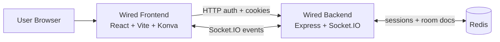
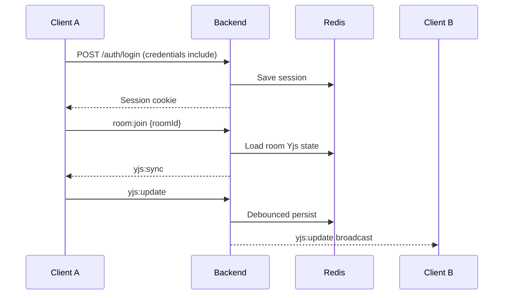

# Wired

Wired is a collaborative visual workspace built as a monorepo with a React frontend and a Node.js backend.  
It combines a polished UI system with real-time multi-user canvas collaboration powered by Yjs CRDT and Socket.IO.


## Project Structure

- `wired-frontend`: React + TypeScript + Vite app for the product UI and collaborative canvas.
- `wired-backend`: Express + Socket.IO + Redis service for authentication, sessions, and room sync.

## Tech Stack

- **Frontend:** React 19, TypeScript, Vite, Tailwind CSS, Zustand, TanStack Query, Konva, Socket.IO client, Yjs
- **Backend:** Node.js, TypeScript, Express 5, Socket.IO, Redis, express-session, connect-redis, Zod, bcryptjs, Yjs
- **Realtime Sync:** Yjs document updates over Socket.IO with Redis persistence and room lifecycle management

## Architecture



### Collaboration Data Flow



## Features

- Email/password auth with Redis-backed server sessions
- Real-time collaborative canvas with CRDT merge behavior
- Room presence events (join/leave, online count, cursor and selection awareness)
- Canvas model persisted to Redis and restored on room rejoin
- Multiple UI surfaces (landing, auth, dashboard, canvas, share/export/loading states)

## Quick Start

### 1) Prerequisites

- Node.js 20+
- npm
- Redis server (local or remote)

### 2) Install dependencies

```bash
cd wired-backend && npm install
cd ../wired-frontend && npm install
```

### 3) Configure environment

Backend:

```bash
cd wired-backend
cp .env.example .env
```

Frontend:

```bash
cd ../wired-frontend
cp .env.example .env
```

### 4) Run both apps

Backend (Terminal 1):

```bash
cd wired-backend
npm run dev
```

Frontend (Terminal 2):

```bash
cd wired-frontend
npm run dev
```

Open `http://localhost:5173`.

## Development Workflow

- Register or log in from the frontend auth screens.
- Open `/canvas` to join the default room, or pass `?room=<room-id>` for a shared room.
- Draw/edit shapes and observe multi-user updates in real time.

## Environment Variables

Backend (`wired-backend/.env`):

- `PORT` (default `4000`)
- `NODE_ENV`
- `FRONTEND_ORIGIN` (default `http://localhost:5173`)
- `SESSION_SECRET`
- `REDIS_URL`
- `SESSION_TTL_SECONDS`
- `ROOM_STATE_TTL_SECONDS`

Frontend (`wired-frontend/.env`):

- `VITE_BACKEND_URL` (default `http://localhost:4000`)

## Project Showcase (for GitHub)

Wired demonstrates:

- A modern product-style UI with reusable design tokens and responsive screens
- Real-time collaborative editing using CRDT semantics instead of last-write-wins
- Session-based auth integrated across HTTP and WebSocket layers
- Practical room management (hydrate, sync, persist, evict) for scalable collaboration flows

## Additional Docs

- Frontend details: `wired-frontend/README.md`
- Backend details: `wired-backend/README.md`
