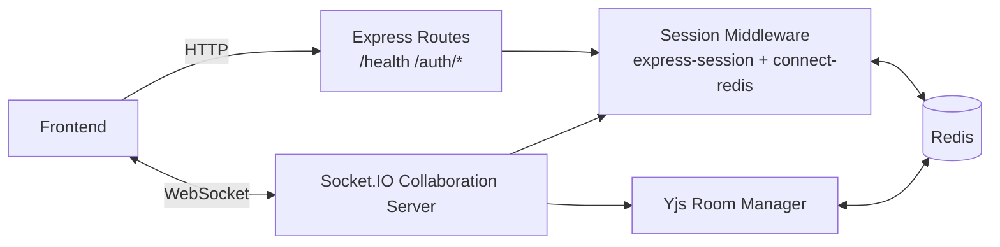

# Wired Backend

Socket.IO + Express backend for Wired collaborative canvas sessions and real-time CRDT sync.


## Stack

- Node.js + TypeScript
- Express 5
- Socket.IO
- Redis 5
- `express-session` + `connect-redis`
- Yjs CRDT
- Zod input validation

## What This Service Handles

- Session-based auth for frontend login/signup flows
- Cookie-backed session persistence in Redis
- WebSocket authorization via shared HTTP session middleware
- Room join/leave presence updates
- Yjs document synchronization and persistence per room
- Legacy canvas snapshot migration into Yjs state

## Backend Architecture



## HTTP Endpoints

- `GET /health` -> health check
- `POST /auth/register` -> create user and session
- `POST /auth/login` -> authenticate existing user and create session
- `POST /auth/logout` -> clear session and cookie
- `GET /auth/me` -> return current session user

## Socket Events

Incoming:

- `room:join` `{ roomId }`
- `room:leave` `{ roomId }`
- `yjs:update` `{ roomId, update }` (base64 CRDT update)
- `awareness:update` `{ roomId, cursor?, selectedId?, tool? }`

Outgoing:

- `auth:error`
- `room:joined`
- `room:user-joined`
- `room:user-left`
- `yjs:sync`
- `yjs:update`
- `awareness:peer`
- `awareness:left`

## Yjs + Redis Data Model

- Live room docs are held in-memory per room.
- Persisted CRDT payload key:
  - `wired:rooms:{roomId}:yjs`
- Legacy JSON snapshot key (one-time migration source):
  - `wired:rooms:{roomId}:state`
- User storage hash:
  - `wired:users:by-email`

Room docs are persisted with debounce and evicted from memory when no sockets remain.

## Environment Variables

Copy template:

```bash
cp .env.example .env
```

Variables:

- `PORT` (default `4000`)
- `NODE_ENV` (`development` | `test` | `production`)
- `FRONTEND_ORIGIN` (default `http://localhost:5173`)
- `SESSION_SECRET` (min 8 chars)
- `REDIS_URL` (required)
- `SESSION_TTL_SECONDS` (default 7 days)
- `ROOM_STATE_TTL_SECONDS` (default 7 days)

## Run Locally

### 1) Install dependencies

```bash
npm install
```

### 2) Start Redis

Run Redis locally or set `REDIS_URL` to a remote instance.

### 3) Start development server

```bash
npm run dev
```

Backend runs at `http://localhost:4000` by default.

## Troubleshooting

### `Error: read ETIMEDOUT` (Redis)

The app cannot reach the host in `REDIS_URL` before the TCP/socket deadline. Typical causes:

- **Redis not running** — start a server on the host/port in `REDIS_URL` (often `localhost:6379`).
- **Wrong host** — e.g. Docker Desktop: use `host.docker.internal` from inside a container instead of `localhost` if Redis runs on the host (or publish port `-p 6379:6379` and use the right hostname).
- **Firewall / VPN** — blocks outbound access to a cloud Redis; allow the port or disable split tunneling for that host.
- **Managed Redis** — IP allowlist must include your current network; TLS may require `rediss://` instead of `redis://`.

Quick local check (replace host/port if needed):

```bash
redis-cli -u "$REDIS_URL" ping
# or
nc -zv localhost 6379
```

On startup, the backend logs the resolved target and a redacted `REDIS_URL` when connection fails.

## Scripts

- `npm run dev` - run with `tsx` in watch mode
- `npm run build` - compile TypeScript to `dist`
- `npm run start` - run compiled server
- `npm run typecheck` - run TypeScript checks without emit

## Frontend Integration Contract

- HTTP requests must include cookies: `credentials: "include"`
- Socket.IO client must enable credentials: `withCredentials: true`
- Recommended sequence:
  1. Authenticate via `/auth/register` or `/auth/login`
  2. Open Socket.IO connection
  3. Emit `room:join`
  4. Apply `yjs:sync`
  5. Continue bidirectional `yjs:update` and awareness events
