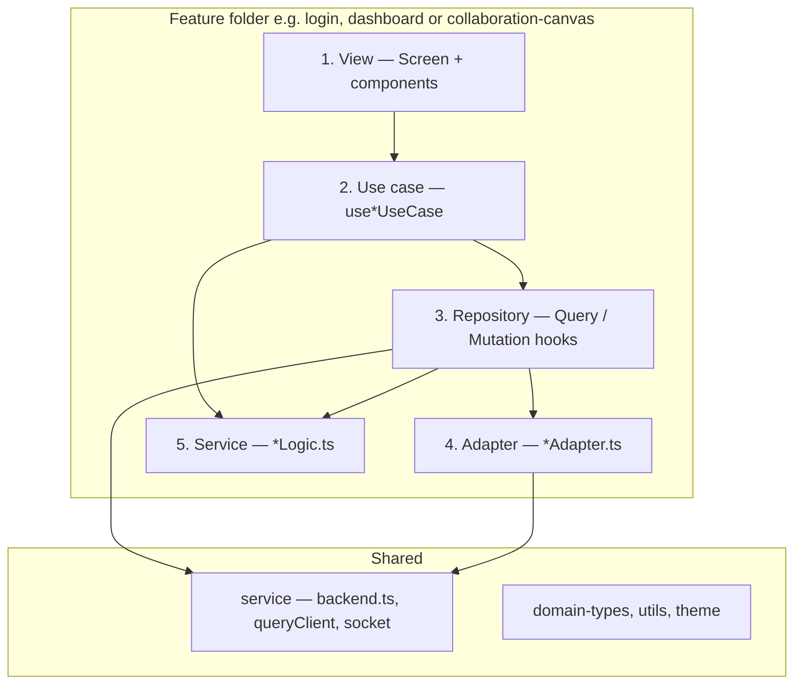

# Wired Frontend

Frontend application for Wired, a collaborative design and whiteboard experience.


## Stack

- React 19 + TypeScript
- Vite 8
- Tailwind CSS
- Zustand for canvas state
- TanStack Query for server-backed state and mutations
- Konva + react-konva for 2D canvas rendering
- Socket.IO client + Yjs for real-time collaboration

## Key Capabilities

- Multi-screen product UI (landing, auth, dashboard, canvas, sharing, export, loading)
- Session-aware auth flow (`/login`, `/signup`, `/auth/me` integration)
- Collaborative canvas with:
  - Shape synchronization via Yjs CRDT updates
  - Presence and awareness (cursor, selected object, active tool)
  - URL document support (`/canvas?document=<document-id>`)

## Architecture

The codebase follows a **feature-first layout** with **co-location**: each vertical slice (e.g. `login/`, `dashboard/`, `collaboration-canvas/`) keeps its UI, orchestration, data access, and HTTP boundary close together. Shared building blocks live under `components/`, `service/`, `domain-types/`, `utils/`, and `theme/`.

Within a feature, responsibilities map to **five functional layers** inspired by clean architecture and separation of concerns. **Dependency direction** flows inward toward the domain and pure logic: views and hooks do not call `fetch` directly; they go through repository-style modules, which call adapters. **Adapters** own the network boundary (and may contain transport-specific logic); **service** modules hold deterministic business rules that are easy to unit test.

| Layer | Responsibility                                                                                                                                                                                                        | Typical artifacts in this repo |
| ----- |-----------------------------------------------------------------------------------------------------------------------------------------------------------------------------------------------------------------------| ------------------------------ |
| **1. View** | Render React/HTML; stay thin; bind events and props to a use case.                                                                                                                                                    | `*Screen.tsx`, presentational components under `components/` |
| **2. Use case** | Orchestrate the user journey: navigation, form state, composing repositories and pure logic.                                                                                                                          | `use*UseCase.ts` hooks (e.g. `useLoginScreenUseCase`, `useDashboardScreenUseCase`) |
| **3. Repository** | Integrate with **application state**: TanStack Query (`useQuery` / `useMutation`), cache keys, invalidation; call adapters and shared infrastructure (`queryClient`). No raw UI. No business logic                    | `use*Mutation.ts`, `use*Query.ts`, `useDashboard.ts`, `useDocument.ts`, etc. |
| **4. Adapter** | Talk to the **network** (and similar I/O): build requests, map responses; may include API-facing rules. Depends on shared HTTP/socket helpers, not on screens. Could have business logic.                             | `*Adapter.ts` (e.g. `loginAdapter`, `dashboardAdapter`, `documentAdapter`) |
| **5. Service** | **Business / application logic** that should stay framework-agnostic and testable: parsing, validation, view-state resolution, error shaping. Side effects are avoided or isolated so units stay pure where possible. | `*Logic.ts` + tests (e.g. `loginLogic`, `dashboardScreenLogic`, `canvasScreenLogic`), plus shared `service/` for the API client, query client, and socket |

**Inversion / boundaries:** UI and use cases depend on **repository-shaped** APIs (hooks and functions), not on adapter implementations. Adapters depend on the low-level **service** transport (`apiRequest`, socket). Pure **service** logic is imported by use cases and repositories without creating cycles.



**Example — `login/`:** `LoginScreen.tsx` (view) → `useLoginScreenUseCase` (use case) → `useLoginMutation` (repository) → `login` in `loginAdapter` (adapter) + `parseLoginFormFields` from `loginLogic` (service). The mutation uses `queryClient` from `service/` to align cache with session.

**Example — `collaboration-canvas/`:** `CanvasScreen` / `CanvasScreenInner` (view) → `useCanvasGateUseCase` / `useCanvasScreenInnerUseCase` (use case) → `useDocumentQuery` / collaboration hooks (repository-style integration) → `documentAdapter` and `service/socket` (adapter / transport) → `canvasScreenLogic` (service) for deterministic view-state helpers.

## Directory Highlights

- **`src/<feature>/`** — vertical slices with co-located view, use case, repository hooks, adapters, and logic (e.g. `login/`, `register/`, `dashboard/`, `collaboration-canvas/`)
- **`src/collaboration-canvas/canvas/`** — Konva drawing, Zustand store, presentation, and interaction hooks for the board
- **`src/components/`** — cross-feature UI (layout, common controls)
- **`src/service/`** — shared HTTP client, React Query client, Socket.IO entry
- **`src/domain-types/`** — shared domain shapes
- **`src/screens/`**, **`src/landing-page/`** — additional routed surfaces where not yet folded into a single feature folder
- **`src/utils/`** — small shared helpers

## Getting Started

### Prerequisites

- Node.js 20+
- npm or Yarn
- Running Wired backend (`wired-backend`) with Redis configured

### Install

```bash
npm install
# or: yarn
```

### Configure env

```bash
cp .env.example .env
```

Default:

```env
VITE_BACKEND_URL=http://localhost:4000
```

### Run

```bash
npm run dev
```

Open `http://localhost:5173`.

## Scripts

- `npm run dev` — start Vite dev server
- `npm run build` — type-check and create production build
- `npm run preview` — preview production build locally
- `npm run lint` — run ESLint
- `npm run test` — run Vitest test suite once
- `npm run test:watch` — run Vitest in watch mode

## Collaboration Flow

1. User logs in or signs up (session cookie established by backend).
2. Canvas flow resolves the user via `/auth/me`; unauthenticated users are redirected to login.
3. Client joins a room over Socket.IO.
4. Initial Yjs document state is synced from server.
5. Local changes are converted to Yjs updates and broadcast to peers.
6. Awareness events render remote cursor/selection/tool metadata.

## Notes for GitHub Showcase

This frontend demonstrates:

- Product-grade visual polish with componentized design-system primitives
- Real-time collaborative UX patterns using CRDT + presence overlays
- Feature-based co-location with a clear split between view, use case, repository (Query/Mutation), adapter, and testable service logic
