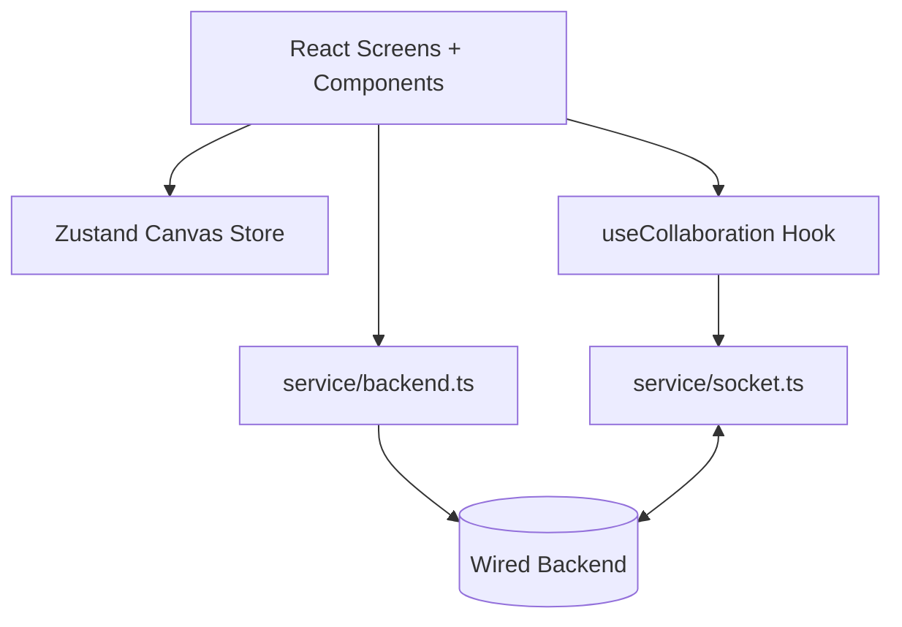

# Wired Frontend

Frontend application for Wired, a collaborative design and whiteboard experience.


## Stack

- React 19 + TypeScript
- Vite 8
- Tailwind CSS
- Zustand for canvas state
- TanStack Query for auth/session data fetching
- Konva + react-konva for 2D canvas rendering
- Socket.IO client + Yjs for real-time collaboration

## Key Capabilities

- Multi-screen product UI (landing, auth, dashboard, canvas, sharing, export, loading)
- Session-aware auth flow (`/login`, `/signup`, `/auth/me` integration)
- Collaborative canvas with:
  - Shape synchronization via Yjs CRDT updates
  - Presence and awareness (cursor, selected object, active tool)
  - URL room support (`/canvas?room=<room-id>`)

## Directory Highlights

- `src/canvas`: realtime collaboration orchestration and Yjs shape mapping
- `src/components/canvas`: drawing, viewport, interactions, and presentation layers
- `src/service`: backend API client, socket singleton, auth hooks, query client
- `src/screens` and feature folders: routed product screens

## Frontend Architecture



## Getting Started

### Prerequisites

- Node.js 20+
- npm
- Running Wired backend (`wired-backend`) with Redis configured

### Install

```bash
npm install
```

### Configure env

```bash
cp .env.example .env
```

Default:

```env
VITE_BACKEND_URL=http://localhost:4000
```

### Run

```bash
npm run dev
```

Open `http://localhost:5173`.

## Scripts

- `npm run dev` - start Vite dev server
- `npm run build` - type-check and create production build
- `npm run preview` - preview production build locally
- `npm run lint` - run ESLint
- `npm run test` - run Vitest test suite once
- `npm run test:watch` - run Vitest in watch mode

## Collaboration Flow

1. User logs in or signs up (session cookie established by backend).
2. Canvas hook resolves user via `/auth/me`; unauthenticated users are redirected to login.
3. Client joins a room over Socket.IO.
4. Initial Yjs document state is synced from server.
5. Local changes are converted to Yjs updates and broadcast to peers.
6. Awareness events render remote cursor/selection/tool metadata.

## Notes for GitHub Showcase

This frontend demonstrates:

- Product-grade visual polish with componentized design-system primitives
- Real-time collaborative UX patterns using CRDT + presence overlays
- Modern React architecture with clearly separated UI, state, API, and collaboration concerns
